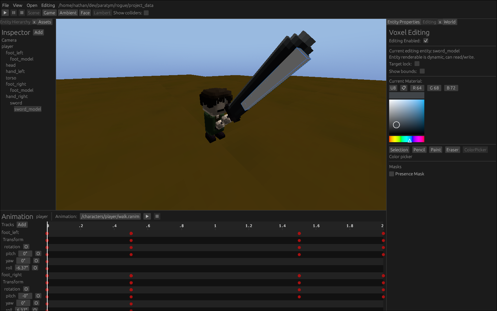

# rogue

A voxel engine that will be used for future games.

## Useful environment variables

`ROGUE_GFX_DEBUG=1` to enable Vulkan validation layers and graphics device error reporting.

`RUST_LOG=log_level` to change the current logs being displayed, usually log level is `info` or `debug`.

## Profiling

I like to use [samply](https://github.com/mstange/samply) and its just `samply record target/debug/rogue` and you get browser-based
flamegraph for cpu perf profiling. [heaptrack](https://github.com/KDE/heaptrack) is also nice for memory profiling like
seeing memory leaks and allocations. 
